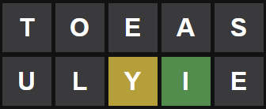
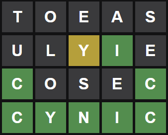

# Parallelized Java Wordle Solver

## Compile

```
javac -d bin src\hong\wordle\util\*.java
javac -d bin -cp bin src\hong\wordle\solver\*.java
```

## Run

```
java -cp bin hong.wordle.solver.Main
```

## How to use

Program output:
```
1 Tries: toeas
>

2 Tries: ulyie
>
```
Wordle input:


Program input:
```
A - Absent (Grey)
P - Present (Yellow)
C - Correct (Green)
```
Example:

Input will be
```
AAPCA
```


## Demo




```
1 Tries: toeas
>AAAAA

2 Tries: ulyie
>AAPCA

3 Tries: cosec
>CAAAC

4 Tries: cynic
>CCCCC

Answer: cynic
```

---

# Wordle Hack

Change directory to .\wordle-hack
```
cd wordle-hack
```

## Python

```
python hack.py
```

## JavaScript

```
node hack.js
```

## Sample Output

```
Date:  2022-02-14
Answer:  cynic
```